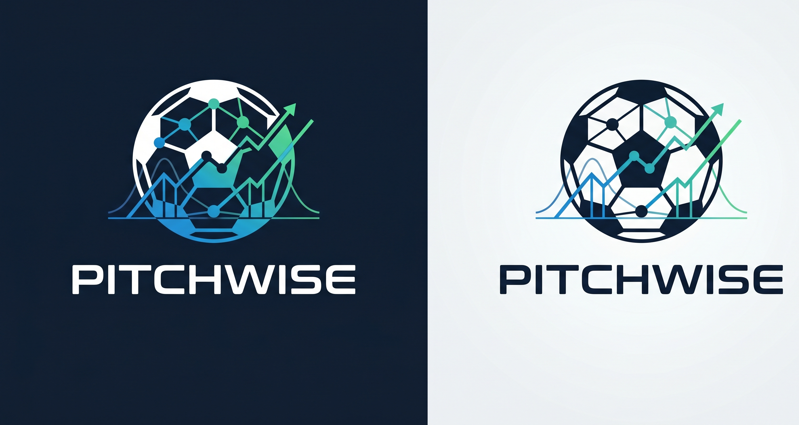

<div align="center">



# Pitchwise

**Calibrated football intelligence — live scores, AI match predictions, and accuracy you can verify.**

Pitchwise combines the real-time match experience of apps like FotMob with a custom-built machine
learning prediction engine, for both the men's and women's game. It's built for football fans who
want live data *and* honest, data-driven insight in one interface.

[](https://github.com/roni-altshuler/soccer_predictor/actions/workflows/ci.yml)
[](https://github.com/roni-altshuler/soccer_predictor/actions/workflows/test_backend.yml)
[](LICENSE)


</div>

> [!IMPORTANT]
> **Educational project — not a betting product.** Predictions are for research and visualisation
> only and must not be used for betting or any financial decision. Even a well-calibrated model
> loses regularly. Licensed under [MIT](LICENSE); see [SECURITY.md](SECURITY.md) and
> [CONTRIBUTING.md](CONTRIBUTING.md) before contributing.

---

## What It Does

- **Live Scores & Match Tracking** — Real-time scores, today's matches grouped by league, and a date-swipe navigation (like FotMob)
- **AI Match Predictions** — Neural-first unified prediction endpoint using 66 match features, calibrated league parameters, and ELO-Poisson fallback
- **Prediction Explainability** — Match detail pages explain model lean using probability separation, standings context, H2H samples, goal profile, confidence, and live stats when available
- **Data Source Transparency** — Match feeds and match detail pages label ESPN/FotMob/model provenance so provider-backed fields are separated from model output and unavailable data
- **League Standings & Fixtures** — ESPN-sourced standings, recent results, upcoming fixtures, and top scorers for all supported leagues
- **Season Simulator** — Monte Carlo simulation (1,000 iterations) on live standings to project title, top-4, Europa, and relegation probabilities
- **AI Accuracy Dashboard** — Full prediction history with per-league accuracy, Brier scores, rolling trend, confidence calibration, and model status
- **Model Quality Gates** — Sportsbook-style governance for coverage, calibration, holdout metrics, model-selection policy, and source-data validation without making betting guarantees
- **Market Intelligence Guardrails** — User-supplied decimal odds or configured licensed-provider odds can be converted into no-vig probabilities and compared with model probabilities for audit-only edge review
- **Personal Team Tracking** — Team watchlists with live-match monitoring, tracked prediction queues, server-synced alert queues, and home-feed filtering for followed clubs
- **News Feed** — Aggregated soccer news from ESPN
- **World Cup 2026 Hub** — FIFA World Cup command center, countdown, readiness panel, tournament page, fixtures, saved scenario simulator cards with export, and `fifa.world` prediction support
- **Tournament Bracket Challenge** — Knockout pick'em groups for World Cup, Champions League, Europa League, Conference League, Euros, and Copa America with saved entries, model-backed AI bracket entries, commissioner scoring rules, live leaderboard scoring, synced room codes, invite-link import, and JSON import/export
- **Progressive Web App** — Installable on desktop/mobile with offline support

---

## Product Roadmap

The May 5, 2026 product roadmap is saved in [`docs/PRODUCT_ROADMAP_2026-05-05.md`](docs/PRODUCT_ROADMAP_2026-05-05.md). The current implementation tranche starts with the strongest and fastest trust-building work:

1. Data Trust Layer
2. Prediction Explainability
3. Mobile Matchday Polish
4. Personal Watchlist Expansion

The remaining roadmap is now mostly production hardening: native Web Push delivery, account/auth ownership, licensed odds-provider configuration, and legal/compliance review. Public sync storage now supports managed Postgres for launch deployments.

---

## The AI/ML Prediction Engine

This is what differentiates Pitchwise from standard live-score apps. The prediction layer now serves through `/api/predict/unified`, which tries the neural ensemble first and falls back to the calibrated ELO-Poisson model only when a neural artifact is unavailable.

### Model Architecture (v5.1.x)

Most trained competitions have a **per-league neural ensemble** containing 7 models. The training script also supports a cross-league `global` challenger model so the project can move toward one shared model trained across domestic leagues, UEFA competitions, MLS, and international tournament history.

| Model | Architecture | Notes |
|-------|-------------|-------|
| **MLP Classifier** | 256→128→64 (ReLU, Adam, early stopping) | Primary outcome predictor |
| **MLP Regressor** | 128→64→32 | Goal prediction (home/away xG) |
| **XGBoost** | 500 estimators, depth 4, lr=0.03 | Gradient-boosted trees |
| **LightGBM** | 500 estimators, 31 leaves, lr=0.03 | Fast gradient boosting |
| **GradientBoosting** | 500 estimators, depth 4, lr=0.03 | Sklearn gradient boosting |
| **RandomForest** | 400 trees, depth 12 | Bagging diversity |
| **ExtraTrees** | 400 trees, depth 12 | Low-correlation ensemble member |
| **AdaBoost** | 300 estimators, depth-4 stumps | Boosted weak learners |

Predictions are combined via a **stacking meta-learner** (logistic regression trained on calibration set) with **isotonic regression calibration** and **temperature scaling**.

### 66-Feature Vector

Features are organized into 13 groups:

| Group | Count | Features |
|-------|-------|----------|
| ELO ratings | 3 | Home/away ELO, ELO difference |
| Form | 12 | 5-game and 10-game form, weighted form, goals scored/conceded averages |
| Home/away splits | 4 | Home win %, away win %, home/away goals per game |
| Head-to-head | 3 | H2H home advantage, avg total goals, match count |
| Context | 6 | Matchday %, derby flag, league coefficient, rest days |
| Season stats | 6 | Points per game, clean sheet %, goal difference per game |
| Momentum | 4 | Win/loss streaks, unbeaten runs |
| Market-implied | 5 | Implied probabilities (H/D/A), over 2.5, market overround |
| Tactical stats | 8 | Shots ratio, shots-on-target ratio, discipline, corner dominance |
| League characteristics | 4 | Draw rate, avg goals, home win rate, competitiveness |
| Poisson xG | 2 | Dixon-Coles corrected expected goals |
| Key interactions | 5 | ELO×form, ELO×H2H, implied×form, rest×form |
| Goal consistency | 2 | Scoring variance (lower = more predictable) |
| Strength of schedule | 2 | Average opponent ELO in recent matches |

### Dixon-Coles Corrected Poisson Baseline

The neural ensemble is blended with a classical statistical model:

- Per-league Poisson models with Dixon-Coles low-score correction (ρ parameter)
- Each league has calibrated parameters in `league_params.json` (draw rate, home advantage, avg goals, ρ)
- Adaptive blending: 60–70% neural ensemble, 30–40% ELO-Poisson depending on confidence entropy

### ELO Rating System

- Dynamic ratings updated after every match with goal-difference multiplier
- 12 competition coefficients (0.75–1.25) to normalize cross-league strength
- Gaussian closeness draw model: `draw = base_rate × (0.6 + 0.8 × exp(−diff²/(2×250²)))`

### Current Model Status

The May 3, 2026 audit is saved in [`docs/PROJECT_AUDIT_2026-05-03.md`](docs/PROJECT_AUDIT_2026-05-03.md). Key findings:

- The unified API is neural-first for trained leagues and returns the model used with each prediction.
- The global model is now fail-closed and benchmarked league by league: runtime can use the league model, the global model, or a calibrated league/global hybrid blend only when `backend/data/models/model_selection.json` says the recent same-fixture gates passed.
- League parameter clamps now prevent impossible values such as negative average goals.
- Training recency weights now use the current UTC year automatically, so 2026 retraining keeps the newest seasons properly emphasized without a manual code edit.
- Scheduled predictions now store their 66-feature vectors, allowing online neural `partial_fit()` to learn from future settled matches without fabricating proxy features.
- A cross-league global model can be trained with `--global-model`; training writes recent holdout metrics, same-fixture global-vs-league-vs-hybrid comparisons, and a model-selection policy. `train_feedback.py` also updates it from the latest settled feature-vector predictions across competitions.

The May 9, 2026 accuracy deep dive is saved in [`docs/MODEL_ACCURACY_DEEP_DIVE_2026-05-09.md`](docs/MODEL_ACCURACY_DEEP_DIVE_2026-05-09.md). It tracks the tournament data repair, the updated global-policy result, and the next methods most likely to improve real prediction quality. The May 11, 2026 implementation added data-quality CI, live-probability availability gates, no-vig market comparison scaffolding, Accuracy dashboard quality gates, and a chronological draw-decision tuning simulation saved in [`docs/MODEL_DECISION_POLICY_TUNING_2026-05-11.md`](docs/MODEL_DECISION_POLICY_TUNING_2026-05-11.md).

### Latest Unified Model Release — May 20, 2026

The new **unified multi-task PyTorch model** is the headline change. Full
release notes: [`docs/MODEL_UNIFIED_RELEASE_2026-05-20.md`](docs/MODEL_UNIFIED_RELEASE_2026-05-20.md).

| Metric | May 9 global challenger | **May 20 unified (men's)** | Δ |
|---|---|---|---|
| Train / test matches | 61,847 / 9,163 | **77,735 / 11,661** | +27% / +27% |
| Test accuracy | 49.6% | **60.56%** | **+10.96pp** |
| Log loss | 1.003 | **0.865** | −0.138 |
| Brier | ≈0.66 | **0.505** | −0.155 |
| Draw recall | <1% | **21.0%** | **+20pp+** |

A second `unified_women.pt` artefact was trained for the new women's
universe (3,210 matches across NWSL, WSL, UWCL, Women's WC, Women's
Euro): **51.45% test accuracy** on a 482-match holdout, with 140
women's teams in the embedding vocabulary.

The unified model is opt-in at the API for now (`?engine=unified` /
`/api/v1/predictions/unified-by-name`); the live `?engine=auto` default
falls back to legacy ELO-Poisson when the unified artefact is missing
or a team isn't in the warehouse. The frontend match-detail page
already has an **AI Prediction** tab rendering the new model.

### Previous Per-League Retrain — May 9, 2026 (legacy)

Last full per-league retrain: **May 9, 2026** using cached/refreshed historical data from 1998+ where available. Latest global-policy refresh: **May 11, 2026** after backfilling UEFA Euro 2000 and rerunning `--global-only`. The repaired global run used **61,847 ESPN/football-data/archive historical matches**, loaded **1,399 settled prediction outcomes**, and trained the global challenger on **63,226 candidate matches**. Each neural artifact uses a chronological **70% train / 15% calibration / 15% test** split.

Tournament data repair completed in this pass:

- UEFA Euro now collects **277 sourced historical matches**: Euro 2004 through Euro 2024 from ESPN range windows plus a curated 31-match Euro 2000 archive because ESPN's current range endpoint returns no Euro 2000 events.
- Copa America now collects **248 sourced historical matches** from ESPN range windows (2001 through 2024).
- Champions League and Europa League no longer miss the current season: the 2025-26 refresh collected **188 completed matches** for each competition.
- ESPN box-score fields now populate tournament tactical features where available: shots, shots on target, corners, fouls, yellow cards, red cards, attendance, phase, and status detail.

| Model | Samples | Train / Cal / Test | Test Accuracy | Macro P/R/F1 | Weighted F1 | Log Loss |
|-------|---------|--------------------|---------------|--------------|-------------|----------|
| Global cross-league | 61,085 | 42,759 / 9,163 / 9,163 | 49.6% | 49.7 / 49.0 / 48.6 | 50.7% | 1.003 |
| Premier League | 8,776 | 6,143 / 1,316 / 1,317 | 45.4% | 41.8 / 41.9 / 41.8 | 44.8% | 1.053 |
| La Liga | 8,757 | 6,129 / 1,314 / 1,314 | 43.9% | 43.7 / 42.6 / 42.5 | 44.8% | 1.070 |
| Bundesliga | 7,172 | 5,020 / 1,076 / 1,076 | 44.3% | 40.6 / 41.6 / 40.1 | 42.9% | 1.062 |
| Serie A | 8,535 | 5,974 / 1,280 / 1,281 | 44.1% | 43.8 / 43.3 / 43.3 | 44.6% | 1.058 |
| Ligue 1 | 8,012 | 5,608 / 1,202 / 1,202 | 45.3% | 41.0 / 41.2 / 41.1 | 44.9% | 1.058 |
| Eredivisie | 6,024 | 4,216 / 904 / 904 | 43.8% | 42.3 / 42.1 / 42.0 | 44.3% | 1.068 |
| Primeira Liga | 4,629 | 3,240 / 694 / 695 | 51.8% | 51.1 / 51.2 / 50.7 | 52.3% | 0.976 |
| MLS | 1,185 | 829 / 178 / 178 | 36.5% | 35.9 / 36.0 / 34.8 | 37.9% | 1.177 |
| Champions League | 2,944 | 2,060 / 442 / 442 | 53.4% | 45.6 / 46.1 / 45.6 | 53.5% | 0.993 |
| Europa League | 3,631 | 2,541 / 545 / 545 | 48.3% | 42.5 / 42.2 / 42.2 | 47.9% | 1.036 |
| World Cup | 297 | 207 / 45 / 45 | 40.0% | 33.0 / 41.2 / 31.2 | 34.4% | 1.159 |
| UEFA Euro | 169 | 118 / 25 / 26 | 34.6% | 35.0 / 34.2 / 34.1 | 34.7% | 1.089 |
| Copa America | 206 | 144 / 31 / 31 | 61.3% | 68.9 / 70.2 / 62.0 | 59.8% | 0.945 |

Corrected model-selection policy after the retrain:

- **Use global model:** `conmebol.america`, `esp.1`, `ger.1`, `por.1`
- **Use hybrid blend:** `eng.1` (65% global), `fra.1` (75% global), `ita.1` (85% global), `ned.1` (75% global), `uefa.champions` (45% global), `uefa.europa` (85% global)
- **Keep league model:** `fifa.world`, `uefa.euro`, `usa.1`
- **World Cup remains league-only for now:** recent global holdout coverage is insufficient even though the `fifa.world` model trained successfully.

Latest decision-policy tuning after the baseline:

- Command run: `python -m backend.scripts.tune_decision_policy --min-season 1998 --apply`
- Chronological split: **42,770 train / 9,165 calibration / 9,166 test** rows.
- The initial May 11 label-decision pass moved test accuracy from **54.16%** current policy to **54.17%** tuned guarded policy and macro F1 from **41.90%** to **43.40%**, mainly by reducing draw under-prediction.
- The May 12 runtime pass now tunes deployable neural/ELO blend weights plus draw thresholds together. With a stricter no-accuracy-regression guard, it retained only conservative probability-quality updates for **Copa America** and **Bundesliga**; the broader runtime search did **not** produce a global accuracy lift.
- `/api/predict/unified` and `predict_upcoming.py` now both use the tuned draw decision policy; scheduled predictions also use the benchmark-gated league/global/hybrid model routing policy.

Important caveats from this run:

- Euro and World Cup remain small-sample tournament models, so their confidence should be displayed conservatively.
- The global model improved the long-term architecture, but the held-out test scores are not high enough to claim guaranteed or betting-grade outcomes. Draws, squad rotation, injuries, and late-season motivation remain hard prediction cases.
- Any provider-missing field should stay unavailable in the UI rather than being filled with a fabricated placeholder.
- Market comparison is audit-only: `/api/market-intelligence` removes sportsbook overround from user-supplied odds, compares no-vig implied probabilities to model probabilities, and returns `guarantee: false` plus `betting_advice: false`.
- Licensed odds ingestion is available at `/api/market-intelligence/live` when `ODDS_API_KEY` or `THE_ODDS_API_KEY` is configured. It uses provider odds for no-vig calibration comparison only and stays disabled rather than scraping or inventing market data when no key is present.

### Automated Pipeline

The GitHub Actions pipeline (`.github/workflows/prediction_pipeline.yml`) runs 3× daily:

| Time (UTC) | Step 1 | Step 2 | Step 3 |
|------------|--------|--------|--------|
| 06:00, 14:00, 22:00 | `fetch_outcomes` — resolve pending predictions against ESPN results | `predict_upcoming` — generate predictions for next 7 days | `train_feedback` — online learning via `partial_fit()` + parameter tuning |

Results are auto-committed back to the repository. New production predictions should be stored before kickoff and resolved only from real results; missing model, weather, venue, referee, or H2H data should be omitted from the UI instead of replaced with fake placeholder values.

Historical source coverage is guarded by `.github/workflows/data_quality.yml` and `python -m backend.scripts.validate_data_quality`. The validator fails if required Euro, Copa America, Champions League, or Europa League source files disappear, return zero rows, or lose required score/result fields.

---

## Supported Competitions (14)

| League | ID | Country |
|--------|----|---------|
| Premier League | `eng.1` | England |
| La Liga | `esp.1` | Spain |
| Serie A | `ita.1` | Italy |
| Bundesliga | `ger.1` | Germany |
| Ligue 1 | `fra.1` | France |
| Eredivisie | `ned.1` | Netherlands |
| Primeira Liga | `por.1` | Portugal |
| MLS | `usa.1` | USA |
| UEFA Champions League | `uefa.champions` | Europe |
| UEFA Europa League | `uefa.europa` | Europe |
| UEFA Conference League | `uefa.europa.conf` | Europe |
| FIFA World Cup 2026 | `fifa.world` | International |
| UEFA European Championship | `uefa.euro` | Europe |
| Copa America | `conmebol.america` | South America |

### World Cup Readiness

The site includes a World Cup countdown, model-readiness panel, and dedicated `fifa.world` tournament hub. FIFA lists the 2026 World Cup opening match on **June 11, 2026** and the final on **July 19, 2026** ([FIFA schedule announcement](https://www.fifa.com/en/tournaments/mens/worldcup/canadamexicousa2026/articles/fifa-world-cup-26-match-schedule-revealed)). Because international tournaments have smaller samples than domestic leagues, World Cup predictions should be validated with both the World Cup artifact and the cross-league global model before the tournament begins.

---

## Tech Stack

| Layer | Technology |
|-------|-----------|
| **Frontend** | Next.js 15 (App Router), TypeScript, Tailwind CSS |
| **Backend** | FastAPI (Python), ESPN API for live data |
| **ML** | scikit-learn (MLP, GBT, RF, ET, AdaBoost), XGBoost, LightGBM |
| **Statistics** | SciPy (Poisson, optimization), NumPy |
| **CI/CD** | GitHub Actions (3× daily prediction pipeline) |
| **PWA** | Service worker, offline caching, installable |
| **Design** | FotMob-inspired dark theme, mobile bottom-tab navigation |

---

## Project Structure

```
soccer_predictor/
├── backend/
│   ├── main.py                     # FastAPI entry point
│   ├── config.py                   # League IDs, settings
│   ├── api/v1/                     # REST API routes (tracking, matches, predictions, leagues)
│   ├── services/
│   │   ├── espn/client.py          # ESPN API client
│   │   ├── prediction/
│   │   │   ├── training.py         # FeatureBuilder (66 features) + ModelTrainer
│   │   │   ├── neural_model.py     # PerLeagueNeuralModel (7-model ensemble v5.1)
│   │   │   ├── probabilistic.py    # Dixon-Coles Poisson + HybridModel
│   │   │   ├── model.py            # Prediction pipeline orchestrator
│   │   │   ├── tracker.py          # PredictionTracker + OutcomeFetcher
│   │   │   └── outcome_fetcher.py  # ESPN result resolution
│   │   ├── ratings/elo.py          # ELO system (12 competition coefficients)
│   │   └── simulation/             # Monte Carlo league simulation
│   ├── scripts/
│   │   ├── train_models.py         # Full training pipeline (multi-season, 2003+)
│   │   ├── predict_upcoming.py     # Generate predictions for next N days
│   │   ├── fetch_outcomes.py       # Resolve pending predictions
│   │   ├── train_feedback.py       # Online learning + parameter adjustment
│   │   └── validate_data_quality.py # Historical tournament/current-season source checks
│   └── data/
│       ├── league_params.json      # Per-league model parameters
│       ├── predictions/            # JSON prediction storage (monthly files)
│       └── models/                 # Per-league trained model artifacts (.pkl + metadata)
├── src/
│   ├── app/
│   │   ├── page.tsx                # Home — today's matches, date navigation
│   │   ├── matches/page.tsx        # League selection + fixtures/standings
│   │   ├── predict/page.tsx        # AI match predictor + season simulator
│   │   ├── tracking/page.tsx       # AI accuracy dashboard
│   │   ├── news/page.tsx           # News feed
│   │   ├── about/page.tsx          # Model documentation
│   │   ├── simulator/page.tsx      # Monte Carlo season simulator
│   │   ├── leagues/[leagueId]/     # League home pages
│   │   ├── matches/[id]/           # Match detail pages
│   │   └── api/                    # 24 API routes
│   ├── components/
│   │   ├── Navbar.tsx              # Desktop top nav + mobile bottom tabs
│   │   ├── Footer.tsx              # Site footer
│   │   ├── league/                 # League home, standings, fixtures
│   │   ├── knockout/               # Tournament bracket visualization
│   │   ├── prediction/             # Season simulator component
│   │   └── tracking/               # Accuracy dashboard components
│   └── data/leagues.ts             # League metadata + flag URLs
├── public/                         # Static assets, PWA manifest, icons
├── .github/workflows/
│   ├── prediction_pipeline.yml     # 3× daily automated pipeline
│   └── data_quality.yml            # Historical source coverage gate
├── requirements.txt                # Python dependencies
├── package.json                    # Node dependencies
└── next.config.js                  # Next.js configuration
```

---

## Getting Started

### Prerequisites

- Python 3.11+
- Node.js 18+
- npm

### Setup

```bash
# Clone and install
git clone <repo-url>
cd soccer_predictor

# Python dependencies
pip install -r requirements.txt

# Node dependencies
npm install
```

### Train Models

```bash
# Train per-league neural ensemble on all available historical data
python -m backend.scripts.train_models --min-season 1998

# Train per-league models plus a cross-league global challenger
# Also writes backend/data/models/model_selection.json with league/global/hybrid promotion gates
python -m backend.scripts.train_models --min-season 1998 --global-model

# Reuse saved league artifacts and retrain only the corrected global challenger/policy
python -m backend.scripts.train_models --min-season 1998 --global-only

# Train specific leagues only
python -m backend.scripts.train_models --leagues eng.1 esp.1

# Recompute diagnostics and calibration tuning from settled prediction history
python -m backend.scripts.model_audit --apply
```

### Generate Predictions

```bash
# Predict upcoming matches (next 7 days)
python -m backend.scripts.predict_upcoming --days 7

# Resolve completed predictions against ESPN results
python -m backend.scripts.fetch_outcomes

# Online learning: update models from outcomes
python -m backend.scripts.train_feedback
```

### Run Locally

```bash
# Development
npm run dev
# → http://localhost:3000

# Production build
npm run build && npm start
```

### Public Launch Persistence

Bracket challenge rooms and watchlist alert queues are backed by managed PostgreSQL in production. Configure one of these environment variables in Vercel, Neon, Supabase, Railway, Render, or another managed Postgres host:

```bash
DATABASE_URL=postgres://...
# or
POSTGRES_URL=postgres://...

# Optional local-only override when your database does not require SSL
PGSSLMODE=disable

# Optional pool size for serverless deployments
PGPOOL_MAX=3
```

The app auto-initializes the required sync tables on first use. For explicit migrations, apply [`db/fotpredict_sync_schema.sql`](db/fotpredict_sync_schema.sql):

```bash
psql "$DATABASE_URL" -f db/fotpredict_sync_schema.sql
```

Use `GET /api/launch-readiness` after deployment to verify that public sync features are running on managed Postgres. If no database URL is configured, local development falls back to `FOTPREDICT_STORE_DIR` or the runtime temp directory, but that fallback is not considered launch-ready.

---

## API Endpoints

### Predictions
| Method | Route | Description |
|--------|-------|-------------|
| POST | `/api/predict/unified` | Neural-first prediction with calibrated ELO-Poisson fallback |
| POST | `/api/predict/any-teams` | Predict any matchup |
| POST | `/api/predict/head-to-head` | H2H prediction with history |
| POST | `/api/predict/cross-league` | Cross-league prediction |
| POST | `/api/market-intelligence` | Convert user-supplied decimal odds to no-vig market probabilities and compare model edge for audit-only review |

### Live Data
| Method | Route | Description |
|--------|-------|-------------|
| GET | `/api/live_scores` | Live match scores |
| GET | `/api/todays_matches` | Today's matches (supports `?date=` param) |
| GET | `/api/standings?league=X` | League standings |
| GET | `/api/upcoming_matches/[league]` | Upcoming fixtures |
| GET | `/api/recent_results/[league]` | Recent results |
| GET | `/api/top-scorers/[league]` | Top scorers |
| GET | `/api/world-cup/readiness` | World Cup model, calibration, diagnostics, and data-integrity status |
| GET/POST | `/api/bracket-rooms` and `/api/bracket-rooms/[roomCode]` | Server-backed tournament bracket room sync with commissioner PIN-protected writes |
| GET/POST | `/api/watchlist-alerts` | Server-backed watchlist alert queue sync by code |
| GET | `/api/launch-readiness` | Public-launch health check for managed sync storage |

### AI Tracking
| Method | Route | Description |
|--------|-------|-------------|
| GET | `/api/v1/tracking/accuracy/summary` | Dashboard data |
| GET | `/api/v1/tracking/accuracy/trend` | Rolling accuracy trend |
| GET | `/api/v1/tracking/predictions` | Paginated prediction history |
| GET | `/api/v1/tracking/model-info` | Per-league model status, model-selection policy decisions, and quality-gate checks |
| GET | `/api/v1/tracking/calibration-trend` | Rolling calibration history with ECE, Brier, log-loss, confidence, and accuracy |
| POST | `/api/v1/tracking/fetch-outcomes` | Trigger ESPN result resolution |

### Simulation
| Method | Route | Description |
|--------|-------|-------------|
| GET | `/api/simulation/[leagueId]` | Monte Carlo season simulation |
| GET | `/api/simulation/[leagueId]?what_if_fixture=X&what_if_outcome=home\|draw\|away` | Fixture-level what-if simulation using provider-backed remaining fixtures |

---

## Design

The frontend is inspired by [FotMob](https://www.fotmob.com) — dark theme, matches-first layout, and mobile bottom-tab navigation. The key design difference is the **AI prediction layer** (highlighted with a purple accent) that surfaces model predictions alongside live match data.

- **Dark theme** — `#0d1117` background, `#161b22` cards
- **Green accent** — `#00c853` for primary actions and live indicators
- **AI purple accent** — `#7c3aed` for prediction-related UI (the differentiator)
- **Mobile-first** — Bottom tab navigation, swipeable date selector
- **Score-centric** — Match rows show teams and scores in a clean, scannable format

### Match Card Data Rules

- Match rows show only provider-backed fields: team names, score, kickoff time/status, league, venue, and real model outputs.
- Venue, referee, weather, H2H, and prediction modules are hidden when source data is unavailable.
- The app must not display random weather, invented referee details, synthetic H2H records, or zero-probability placeholders as if they were real.
- Source badges identify ESPN/FotMob/model provenance on match feeds and match detail pages.
- Match detail pages can add either team directly to the local watchlist.
- Live win probability is returned and visualized only when the match is live and score, clock, pre-match model probability, and provider live stats are available.
- The World Cup hub includes a command-center board that keeps fixtures, groups, scorer data, model readiness, scenario controls, and saved scenario cards in one workflow.
- Tournament challenge pages can generate a Pitchwise bracket entry from current simulation probabilities; unknown matchups stay unpicked rather than fabricated.
- Synced bracket rooms and alert queues use managed Postgres when `DATABASE_URL` or `POSTGRES_URL` is configured. `FOTPREDICT_STORE_DIR` and temp-file storage are local/staging fallbacks only.
- Prediction cards label model outputs clearly and preserve the model version/source when provided.

---

## Disclaimer

This project is for **educational and entertainment purposes only**. Predictions are based on statistical models and historical data. Football outcomes are inherently unpredictable. The app can compare probabilities to user-supplied odds for calibration review, but it does not provide betting advice and cannot guarantee outcomes. **Do not use for betting.**

Match data is sourced from ESPN and FotMob public endpoints where available. This project is not affiliated with ESPN, FotMob, FIFA, or any football organization.

---

## License

Released under the [MIT License](LICENSE) — you may use, modify, and distribute the source with
attribution. Note that the educational/no-betting disclaimer above still applies to how the
*predictions* are used, and trained model artifacts (`*.pt`) and third-party data are **not**
covered by this license (see [Disclaimer](#disclaimer)).

## Contributing

Contributions are welcome — see [CONTRIBUTING.md](CONTRIBUTING.md) for the development workflow,
branch strategy, and commit conventions, and [SECURITY.md](SECURITY.md) to report a vulnerability.
Release notes live in [CHANGELOG.md](CHANGELOG.md).

---

## Acknowledgments

- [ESPN](https://www.espn.com) — Live scores, standings, fixtures, and news data
- [FotMob](https://www.fotmob.com) — Design inspiration
- [scikit-learn](https://scikit-learn.org) — MLP, GBT, RF, ExtraTrees, AdaBoost
- [XGBoost](https://xgboost.readthedocs.io) — Gradient boosting
- [LightGBM](https://lightgbm.readthedocs.io) — Fast gradient boosting
- [Next.js](https://nextjs.org) — React framework
- [SciPy](https://scipy.org) — Statistical computing
