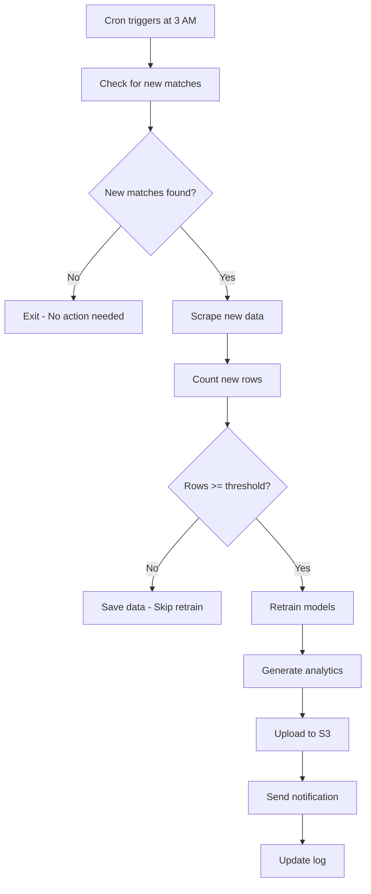

# Auto-Update Scheduling Guide

This guide explains how to set up automatic data updates for the Soccer Predictor to keep models fresh with new match data.

## Overview

The `scripts/auto_update.py` script automates:

1. Checking for new matches since last update
2. Scraping new match data from FBRef
3. Retraining models when enough new data is collected
4. Generating updated analytics visualizations
5. (Optional) Uploading updated models to cloud storage

## Scheduling Options

### Option 1: Cron (Linux/macOS)

**Best for**: Running on a server or always-on machine

**Setup:**

1. **Make sure virtual environment is activated in cron:**

```bash
crontab -e
```

2. **Add one of these schedules:**

```cron
# Run daily at 3 AM
0 3 * * * cd /home/roaltshu/code/soccer_predictor && ./.venv/bin/python scripts/auto_update.py >> logs/cron.log 2>&1

# Run twice weekly (Tuesday & Saturday at 2 AM)
0 2 * * 2,6 cd /home/roaltshu/code/soccer_predictor && ./.venv/bin/python scripts/auto_update.py >> logs/cron.log 2>&1

# Run weekly on Monday at 1 AM
0 1 * * 1 cd /home/roaltshu/code/soccer_predictor && ./.venv/bin/python scripts/auto_update.py >> logs/cron.log 2>&1
```

3. **Verify cron is running:**

```bash
crontab -l  # List current cron jobs
tail -f logs/cron.log  # Watch logs in real-time
```

### Option 2: Task Scheduler (Windows)

1. Open Task Scheduler
2. Create Basic Task
3. **Trigger**: Daily/Weekly at preferred time
4. **Action**: Start a program
   - Program: `C:\path\to\soccer_predictor\.venv\Scripts\python.exe`
   - Arguments: `scripts\auto_update.py`
   - Start in: `C:\path\to\soccer_predictor`

### Option 3: GitHub Actions (Cloud-based)

**Best for**: Automatic updates without running local machine

Create `.github/workflows/auto-update.yml`:

```yaml
name: Auto Update Models

on:
  schedule:
    # Run every Monday at 2 AM UTC
    - cron: "0 2 * * 1"
  workflow_dispatch: # Allow manual trigger

jobs:
  update:
    runs-on: ubuntu-latest

    steps:
      - uses: actions/checkout@v4

      - name: Set up Python
        uses: actions/setup-python@v5
        with:
          python-version: "3.12"
          cache: "pip"

      - name: Install dependencies
        run: |
          pip install -r requirements.txt

      - name: Run auto-update
        run: |
          python scripts/auto_update.py
        env:
          AWS_ACCESS_KEY_ID: ${{ secrets.AWS_ACCESS_KEY_ID }}
          AWS_SECRET_ACCESS_KEY: ${{ secrets.AWS_SECRET_ACCESS_KEY }}

      - name: Upload models to S3 (if using cloud storage)
        run: |
          aws s3 sync fbref_data s3://soccer-predictor-data/fbref_data \
            --exclude "*.csv" --include "*/models/*"

      - name: Commit updated data
        run: |
          git config user.name "GitHub Actions"
          git config user.email "actions@github.com"
          git add fbref_data/*/data/processed.csv
          git add fbref_data/*/models/
          git add fbref_data/*/visualizations/
          git commit -m "chore: automated data update $(date +'%Y-%m-%d')" || echo "No changes"
          git push
```

### Option 4: Heroku Scheduler (Cloud)

If using Heroku for deployment:

```bash
heroku addons:create scheduler:standard
heroku addons:open scheduler
```

Add task:

- **Command**: `python scripts/auto_update.py`
- **Frequency**: Daily at 2:00 AM UTC

### Option 5: AWS Lambda + EventBridge

For serverless automatic updates:

1. Package code + dependencies as Lambda layer
2. Create Lambda function with Python 3.12
3. Set EventBridge rule: `cron(0 2 * * ? *)` # Daily at 2 AM
4. Grant S3 permissions to upload updated models

## Recommended Schedule

### During Active Season (Aug-May):

- **Daily updates**: Best for upcoming matches feature
- **Time**: 3-4 AM local time (after matches complete)

```cron
0 3 * * * cd ~/soccer_predictor && ./.venv/bin/python scripts/auto_update.py
```

### Off-Season (Jun-Jul):

- **Weekly updates**: Less frequent, conserves resources

```cron
0 2 * * 1 cd ~/soccer_predictor && ./.venv/bin/python scripts/auto_update.py
```

## Configuration

### Environment Variables

Add to `.env` or system environment:

```bash
# Auto-update settings
AUTO_UPDATE_ENABLED=true
RETRAIN_THRESHOLD=50  # Minimum new matches before retraining
LEAGUES_TO_UPDATE=all  # Or specific: premier_league,la_liga

# Cloud storage (if using S3)
AWS_ACCESS_KEY_ID=your_key
AWS_SECRET_ACCESS_KEY=your_secret
AWS_S3_BUCKET=soccer-predictor-data

# Notifications (optional)
SLACK_WEBHOOK_URL=https://hooks.slack.com/...
DISCORD_WEBHOOK_URL=https://discord.com/api/webhooks/...
```

### Modify Behavior

Edit `scripts/auto_update.py`:

```python
# Line 51-56
LEAGUES_TO_UPDATE: str = "premier_league"  # Single league only
RETRAIN_THRESHOLD: int = 100  # More conservative retraining
```

## Monitoring

### Check Logs

```bash
# View today's log
cat logs/update_$(date +%Y%m%d).log

# Watch live
tail -f logs/update_$(date +%Y%m%d).log

# Search for errors
grep -i error logs/update_*.log
```

### Health Checks

Run health check only (no updates):

```bash
python scripts/auto_update.py --check-only
```

Expected output:

```
Health check passed
  - 5 data files
  - 5 trained models
```

## Notifications (Optional)

Add Slack/Discord notifications for update status:

### Slack Integration

Add to `scripts/auto_update.py`:

```python
import requests

def send_slack_notification(message: str):
    webhook_url = os.getenv('SLACK_WEBHOOK_URL')
    if not webhook_url:
        return

    requests.post(webhook_url, json={"text": message})

# Usage
send_slack_notification(f"✅ Auto-update completed: {new_rows} new matches")
```

### Discord Integration

```python
def send_discord_notification(message: str):
    webhook_url = os.getenv('DISCORD_WEBHOOK_URL')
    if not webhook_url:
        return

    requests.post(webhook_url, json={"content": message})
```

## Troubleshooting

### Issue: Script fails silently in cron

**Solution**: Redirect output to log file

```cron
0 3 * * * cd ~/soccer_predictor && ./.venv/bin/python scripts/auto_update.py >> logs/cron.log 2>&1
```

### Issue: "Module not found" in cron

**Solution**: Use full path to Python and script

```cron
0 3 * * * /home/user/soccer_predictor/.venv/bin/python /home/user/soccer_predictor/scripts/auto_update.py
```

### Issue: Scraping gets blocked

**Solution**: Add delay between requests, use rotating User-Agents

```python
# In scrape_all_leagues.py
import time
time.sleep(2)  # 2 second delay between league scrapes
```

### Issue: Models not updating

**Solution**: Check retrain threshold

```bash
# Force retrain regardless of new data
python scripts/auto_update.py --force
```

## Manual Execution

### Full update (force retrain):

```bash
python scripts/auto_update.py --force --leagues all
```

### Specific league only:

```bash
python scripts/auto_update.py --leagues premier_league
```

### Health check only:

```bash
python scripts/auto_update.py --check-only
```

## Best Practices

1. **Test manually first** - Run `python scripts/auto_update.py` before scheduling
2. **Monitor logs** - Check first week of automated runs daily
3. **Set reasonable thresholds** - Don't retrain for <50 new matches
4. **Backup before updates** - Keep copy of working models
5. **Use cloud storage** - Sync updated models to S3 after retraining
6. **Rate limit scraping** - Respect FBRef's servers
7. **Error notifications** - Get alerts when updates fail

## Cost Considerations

### Running Locally (Free)

- Cron/Task Scheduler: No cost
- Only electricity for computer

### GitHub Actions (Free Tier)

- 2,000 minutes/month
- Each run ~5-10 minutes
- Can do ~200-400 updates/month free

### AWS Lambda (Pay-per-use)

- $0.20 per 1M requests
- Essentially free for this use case

## Example Workflow



## Next Steps

1. Choose scheduling method (cron recommended for local)
2. Set up first scheduled run
3. Monitor logs for first week
4. Adjust threshold/frequency as needed
5. Add cloud storage sync (optional)
6. Set up monitoring/alerts (optional)

---

**Questions?** Check logs in `logs/update_YYYYMMDD.log` for debugging.
