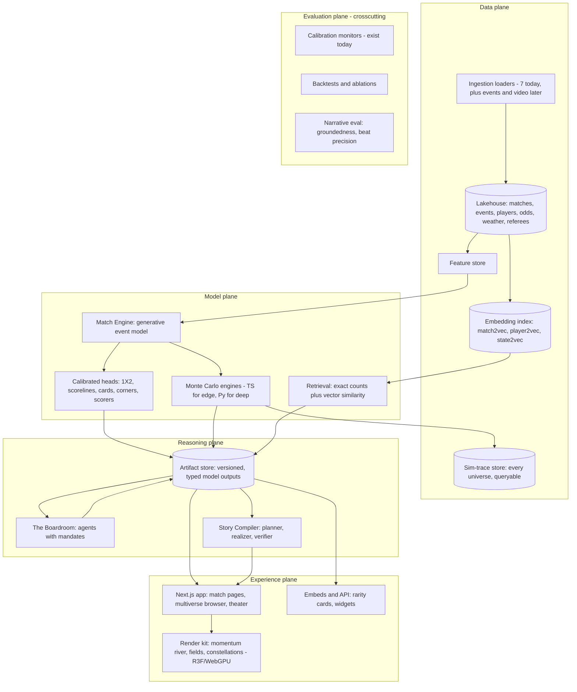

# VISION 2030 — From a prediction site to a world model of football

*Drafted 2026-07-14. A brainstorming and direction document, not a spec. It deliberately
ignores near-term engineering constraints in the first half and re-introduces them,
honestly, in the second half.*

---

## 1. The thesis

Every product we ship today answers one question: **"who will win?"**
Every product worth building next answers four:

| Verb | Question | Today | Vision |
|---|---|---|---|
| **Predict** | What will happen? | 1X2 + scoreline | Full event-level futures: scorers, cards, corners, subs, minute-by-minute win prob |
| **Explain** | Why? | SHAP attributions | Causal, tactical, human-readable reasoning behind every number |
| **Retrieve** | Has this happened before? | — | "This comeback has occurred 16 times in 81,000 matches" — with receipts |
| **Counterfact** | What could have happened instead? | League what-if lab | Fork any real match at any minute and watch a thousand ghost futures diverge |

The unifying bet — the thing that makes this **one platform** rather than six
features — is a single **generative world model of football**: a foundation
model trained on match event streams that can *roll a match forward from any
state*. Prediction is rolling forward from kickoff. Live win probability is
rolling forward from now. Counterfactuals are rolling forward from an edited
state. Rarity is comparing a state against every state in history. Storytelling
is narrating the deltas. Tournament simulation is rolling forward 104 times,
10,000 times over.

One engine, one retrieval index, one narrative compiler — many products.
The three projects that inspired this document each built *one* of these
capabilities as a demo. None of them built the engine underneath. That is the
original contribution: **not a visualization, not a simulation, not a stat —
a queryable model of the sport with four verbs.**

A useful identity test for every future feature: *which verb is it?* If it's
none of the four, it probably belongs somewhere else.

---

## 2. Brand

"Pitchwise" says *smart about football*. The vision above says *a universe of
football that you can explore, rewind, and fork*. Candidates, with trade-offs:

| Name | Case for | Case against |
|---|---|---|
| **Pitchverse** ⭐ | Keeps the "pitch" equity; literally describes the multiverse-of-matches product; sibling to MotorsportVerse — an ecosystem brand emerges for free | "-verse" is trendy; may date |
| **Parallel Pitch** | Counterfactuals are the flagship; alliterative, ownable | Longer; harder domain |
| **Matchday** | Already our internal design-language name; warm, football-native | Generic; likely trademark collisions (EA and others) |
| **The Gaffer** | Charming manager-brain persona for the AI | Narrows the brand to the manager angle |
| **Momentum** | Names the signature visualization | Too abstract, crowded namespace |

**Recommendation: Pitchverse**, with "Matchday" retained as the design-language
name and the world model itself named the **Match Engine**. Do a proper
trademark/domain search before committing. The rebrand should land *with* the
first flagship feature (the Counterfactual Machine or the Rarity Engine), so the
new name arrives attached to a new capability, not as a coat of paint.

---

## 3. Seven flagship concepts (the original product, not copies)

### 3.1 The Counterfactual Machine — *fork reality*
Scrub any match on a timeline. At minute 61, tap **Fork**. Edit the state:
make that substitution earlier, un-concede that corner, show the red card that
wasn't given. The Match Engine rolls 1,000 futures from the edited state and
the momentum river splits — the solid stream of what happened, and a translucent
braid of what could have. Post-match: "the game that could have been." Live:
"what has to change." No one has shipped this as a consumer product. It is the
defining feature; everything else feeds it.

### 3.2 The Rarity Engine — *every moment stamped with history*
Every state a match passes through gets a historical frequency: "teams trailing
2-0 at the 79th minute have won 0.16% of the time (16 of 10,412)." Two layers,
deliberately separate:
- **Exact counting** on the warehouse for *legible* claims — a rarity number a
  journalist can quote must come from countable rows, never from an embedding.
- **Match-state embeddings** (see §9) for *fuzzy* retrieval — "show me the ten
  most similar matches to this one," where similarity means trajectory shape,
  not just scoreline.
Output surface: **rarity cards** — shareable, branded, auto-generated the moment
something rare happens. This is the organic-growth engine; rare moments are
exactly the moments people screenshot.

### 3.3 The Story Compiler — *the match page becomes a narrative*
After full time, the match page reorganizes itself into acts. Turning points are
*detected, not written*: the k largest |Δ win probability| swings, momentum
reversals, rarity spikes. A deterministic **planner** selects beats from model
artifacts; an LLM **realizer** writes the prose; a **verifier** rejects any
sentence whose claim can't be traced to an artifact id. The story is interactive
— every sentence is a link into the timeline, every number expands into its
chart. Grounded generation is the whole game here: a story engine that
hallucinates once is dead.

### 3.4 The Boardroom — *agents that disagree in public*
Not one AI opinion — a panel with mandates that conflict on purpose:
- **The Quant** reads only the model outputs.
- **The Historian** reads only retrieval (precedents, H2H, rarity).
- **The Tactician** reasons about matchups, style vectors, set pieces.
- **The Physio** tracks availability, congestion, fatigue.
- **The Skeptic** red-teams the others with calibration history ("the model has
  been overconfident on derbies").
- **The Market Analyst** compares the house view to bookmaker consensus as an
  *efficiency study* — where does our model disagree with the market and who
  has historically been right? (Analysis only; the platform stays educational
  and never produces betting recommendations.)
They publish a **house view with a dissent index**. Disagreement is not noise to
be averaged away — it is the epistemic-uncertainty display. When the Boardroom
splits 4–2, that *is* the story.

### 3.5 The Match Theater — *cinematic replay*
The signature visual language, built in layers so each is honest about its data:
- **Momentum river** (2D, ships first): a flowing band whose width is control
  and whose color is danger, with goals as breaks in the current. This becomes
  the brand image, the way the snake chart was FiveThirtyEight's.
- **Pressure field**: a heat surface over the pitch that breathes with xT.
- **Pass-network constellation**: players as stars, passes as edges, the
  formation drifting and deforming as the match ages.
- **3D reconstruction** (later, tracking-gated): camera-flyable replay. Honesty
  rule inherited from our design language: *positions we didn't measure are
  rendered as fields and flows, never as fake player dots.* Event-only data
  gives you weather systems, not GPS traces — embrace that aesthetic.

### 3.6 The Tournament Multiverse — *browse the universes*
We already run 10,000-season Monte Carlos. Stop throwing the traces away.
Store every simulated universe; let users *walk* them: "France exit in the R16
in 8.2% of universes — show me one." Path queries: "universes where the title
is decided on the last day," "where all four semifinalists are non-European."
Season Time Machine: replay 2025-26 ten thousand times → the luck distribution,
the deserved table, "how improbable was what actually happened?" The MC engines
exist; this is a storage format plus an exploration UX.

### 3.7 The Almanac — *ask football anything, get receipts*
A natural-language interface over the warehouse + embeddings + engine:
"How often does the team that scores first in a Clásico win?" → exact count,
the matching matches listed, a one-tap story. The Almanac is the Boardroom's
Historian exposed directly to users, and the cheapest of the seven to ship.

---

## 4. Ideas you probably haven't considered

1. **Match-state embeddings as THE core asset** ("match2vec"). One contrastive
   encoder over state trajectories unlocks similarity search, rarity, archetype
   clustering, and cross-league transfer — including men's↔women's transfer,
   where shared embedding space lets the smaller women's dataset borrow
   statistical strength instead of being the neglected sibling.
2. **Narrative archetypes as formal objects.** Cluster matches as trajectories
   in (win-prob, momentum, xT) phase space → "the Siege," "the Smash-and-Grab,"
   "the Collapse," "the Shootout." Every match gets an archetype tag; rarity
   becomes *rarity within archetype*; the Story Compiler picks templates by
   archetype. Nobody has a taxonomy of matches.
3. **The referee as a first-class simulation input.** We already compute a
   referee factor. Promote it: booking/penalty tendencies change fork outcomes
   ("with this referee, that 68th-minute tackle is a red in 40% of universes").
4. **The Justice Ledger.** A season-long luck-adjusted table (xG-based deserved
   points vs actual) with a weekly "most robbed team" feature. Fan catnip,
   trivially computable from data we already have.
5. **Pressbox mode.** Live, multilingual (Hebrew included), model-grounded text
   commentary — every line cites a state change. This is the Story Compiler
   running in streaming mode, and a genuine differentiator for under-served
   languages and under-covered leagues.
6. **The human calibration lab.** Users predict; we score them with the same
   Brier/calibration machinery the model gets. Leaderboards of humans vs the
   model vs the market. We already built bracket challenges — this is that,
   with the accuracy page's rigor. Also quietly generates labeled data.
7. **Turning-point labeling as a data flywheel.** "Was this the turning point?"
   one-tap feedback on story beats → preference data for the Story Compiler.
8. **Set-piece intelligence.** Corners are the one phase where public tracking
   data and published research (TacticAI) are dense. A focused set-piece model
   is achievable and demos brilliantly.
9. **Congestion & fatigue index.** Schedule-graph mining: days-rest deltas,
   travel, competition load → a published fatigue index feeding predictions and
   the Physio agent. Mostly deterministic; reads as deep insight.
10. **Embeddable artifacts as the B2B wedge.** Rarity cards, win-prob widgets,
    momentum rivers as embeds/API for newsletters and blogs. The route to
    revenue that doesn't touch gambling.
11. **Video mining for the long tail.** SoccerNet-family models extract events
    from broadcast/highlight video. Long-term, this is how leagues nobody
    covers — including most women's leagues — get event data at all. Legal
    review required; the capability compounds forever.
12. **A "model zoo" transparency page.** Every subsystem lists its live
    calibration, last retrain, known failure modes. The accuracy page grown into
    an institutional trust asset — the anti-black-box positioning that separates
    us from every "AI predicts X" Instagram demo.

---

## 5. Feature catalog

### Prediction
| Feature | Powered by | Horizon |
|---|---|---|
| 1X2 + scoreline matrix (have) | Calibrated heads | Now |
| Minute-by-minute live win prob v2 | Engine rollouts from live state | Near |
| First/anytime scorer | Player-hazard heads on rollouts | Near |
| Cards, corners, fouls distributions | Event-count heads | Near |
| Likely substitutions + impact | Sub-timing model + fork deltas | Near/Research |
| Possession & territory forecast | Style vectors + engine | Near |
| Passing-network forecast | GNN over predicted lineups | Research |
| Player match ratings (predicted) | VAEP-style value attribution | Near |

### Simulation
| Feature | Powered by | Horizon |
|---|---|---|
| League/tournament Monte Carlo (have) | TS engines | Now |
| Universe browser + path queries | Stored sim traces | Now |
| Match-level forks (Counterfactual Machine) | Match Engine | Near |
| Injury/rotation/weather scenarios | Scenario knobs on sims | Near |
| Fatigue accumulation across congested schedules | Congestion index | Near |
| Transfer what-ifs ("insert player X") | Player-vector swap in engine | Research |
| RL tactical managers | GRF-style environments | Research |

### AI & reasoning
| Feature | Powered by | Horizon |
|---|---|---|
| The Boardroom (agents with mandates + dissent index) | LLM tool-use over typed APIs | Now |
| The Almanac (NL → receipts) | Text-to-SQL + embeddings + verifier | Now |
| Explainability ledger ("63% because…") | Artifacts + attribution + realizer | Now |
| The Skeptic (self-red-teaming vs calibration history) | Accuracy tracker as a tool | Now |
| Market-efficiency studies (analysis only, never advice) | Odds columns already in warehouse | Now |

### Visualization
| Feature | Powered by | Horizon |
|---|---|---|
| Momentum river (signature) | D3/SVG → WebGL | Now |
| Rarity cards (shareable) | OG-image pipeline (exists) | Now |
| Pressure field + xT particles | R3F/WebGPU shaders | Near |
| Evolving pass-network constellation | Event data + force layout | Near |
| Forked-timeline braid | Counterfactual traces | Near |
| 3D Match Theater | Tracking or imputed tracking | Research |

### Storytelling
| Feature | Powered by | Horizon |
|---|---|---|
| Post-match interactive story (acts, beats, links) | Story Compiler | Now |
| Rarity stamps inline ("16 times in 81k matches") | Rarity Engine | Now |
| Pressbox live commentary (multilingual) | Streaming compiler | Near |
| Season retrospectives ("how improbable was this title?") | Time Machine | Near |
| Voice narration / audio recaps | TTS over compiled stories | Near |

### Analytics
| Feature | Powered by | Horizon |
|---|---|---|
| Justice Ledger (luck-adjusted tables) | xG columns (have) | Now |
| Style vectors & tactical matchup pages | Action-distribution factorization | Near |
| Congestion/fatigue index | Schedule graph | Now |
| Referee tendency pages | Referee table (have) | Now |
| Cross-league strength ladder (women's first-class) | Unified rating lattice + uncertainty | Near |
| Human-vs-model-vs-market calibration lab | Existing tracking rigor | Now |

---

## 6. Long-term architecture

Four planes. The rule that keeps the system sane: **products never talk to
models — products talk to artifacts.** Every model run (prediction, sim batch,
fork, retrieval) writes a versioned, typed artifact; stories, agents, pages,
and cards all read artifacts. That one rule buys reproducibility ("this story
cites sim run #8842"), honesty (verifier checks claims against artifacts), and
cacheability (Vercel never waits on a GPU).

Migration notes from today's stack:
- **SQLite → DuckDB/Postgres + Parquet** when event-level data lands (81k match
  rows are fine in SQLite; 50M event rows are not). pgvector for embeddings.
- **The Match Engine needs a GPU inference service** (Modal/Replicate-style
  serverless GPU, or a small always-on box). Keep the engine small (§8) and
  distill aggressively; Vercel stays a pure artifact reader.
- The TS Monte Carlo engines remain the edge/interactive tier; deep engine runs
  are precomputed server-side into the trace store.
- The artifact store is the new contract. Start it as a directory of typed JSON
  (we already do this with predictions); formalize with schemas + run ids.

---

## 7. Data: what we have, what each rung of the ladder buys

**Owned today** (audited 2026-07-14): 80,945 matches across 13 men's + 5
women's competitions with final score, shots/SOT, corners, cards, xG, **odds
(1X2 + O2.5)**, referee, venue, attendance, weather join; 41,877
player-match-stat rows; ClubElo history; two trained unified models with a
calibration pipeline and a 1,400+ pick public track record. Missing: **minute
of every goal** (the single highest-value absent column), event streams,
lineups (table exists, empty), tracking.

| Rung | Sources | Unlocks | Cost |
|---|---|---|---|
| **0 — Free, now** | ESPN scoringPlays (goal minutes!), Understat shots (minute + xG per shot), football-data.co.uk, ClubElo, OpenFootball | Rarity Engine v1 (comeback/state queries), Justice Ledger, first Story Compiler beats | Engineering time only |
| **1 — Open research data** | StatsBomb Open Data (full event streams incl. women's World Cups + WSL — a women's-first gift), Metrica & SkillCorner open tracking samples, SoccerNet video corpus | Train Match Engine v0, xT/VAEP pipelines, set-piece studies, viz prototypes on real event data | Free (license: non-commercial research — check before commercial use) |
| **2 — Affordable API** | Sportmonks / API-Football tier | Live lineups, goal minutes at scale, injuries/suspensions, broader league coverage | ~$50–300/mo (verify current pricing) |
| **3 — Professional events** | Hudl StatsBomb, Stats Perform Opta | Full commercial event feeds, player-level everything, women's leagues in depth | Five figures+/yr; the B2B revenue gate |
| **4 — Tracking** | SkillCorner (broadcast-derived), Second Spectrum/Genius | Real pressure maps, pitch control, honest 3D theater | Six figures/yr; partnership territory |
| **∞ — Make our own** | SoccerNet-family video models on broadcast/highlights | Event data for the long tail no vendor covers | R&D + legal review |

Strategy: exhaust rungs 0–1 (they cover the entire Phase 0–1 roadmap), take
rung 2 when live products need it, and treat rungs 3–4 as *revenue-gated*, not
aspiration-gated.

---

## 8. Models per subsystem

| Subsystem | Recommended approach | Notes |
|---|---|---|
| **Match Engine (core)** | Decoder-only transformer over tokenized events (type ⊗ zone ⊗ outcome, Δt buckets, team/player embeddings), 20–150M params — the "LEM" (Large Events Model) family direction | Small enough to serve cheaply; trained on StatsBomb open + rung-2 events; every product is a rollout or a state query against it |
| Scorelines | Keep Dixon-Coles bivariate Poisson as the calibrated, explainable baseline; engine rollouts must *beat it on Brier before replacing it* | The baseline is the Skeptic's yardstick — never delete it |
| Live win probability | Bayesian state-space over (score, reds, xT rate) blended with engine rollouts; conformal intervals | Upgrade path from today's heuristic, which already has the right honesty guards |
| Player ratings & value | VAEP / xT attribution over events (socceraction lineage); minutes-weighted regularized plus-minus prior | Public, peer-reviewed methods — aligns with the transparency brand |
| Tactical / set pieces | GNNs over pass networks and set-piece frames (TacticAI direction, PyTorch Geometric); style vectors via NMF on action distributions | Corners first: densest public data + strongest prior art |
| Pressure/pitch control | Spearman-style pitch control & EPV — *only where tracking exists*; event-only surfaces are labeled approximations | Honesty rule from the design language carries over |
| Tracking imputation | Graph-imputer / diffusion models from broadcast footage | Research track; unlocks the 3D theater |
| Similarity & rarity | Contrastive state-sequence encoder → pgvector; **exact SQL counts for every public-facing rarity number** | Embeddings suggest, counts assert |
| Formation/archetype detection | Clustering + HMMs over average-position windows; trajectory clustering in phase space for match archetypes | Cheap, interpretable |
| Fatigue/injury | Survival models on workload features; publish with wide uncertainty | Ceiling is low — be the site that says so out loud |
| Agents (Boardroom, Almanac) | Claude family, tiered: frontier model for the Skeptic/synthesis, mid-tier for routine agents, small for extraction; strict tool-use over typed artifact APIs; structured outputs | Cost control via tiering + caching; agents never see raw data, only artifacts |
| Story Compiler | Deterministic planner (rules over artifacts) → LLM realizer → verifier that rejects uncited claims | The planner/realizer split is what makes stories trustworthy |
| RL managers | Google Research Football–style environments for experimentation | Explicitly research; fun lab, not a promise |

---

## 9. Technical challenges (the honest list)

1. **Data licensing is the moat — someone else's moat.** Event/tracking data is
   expensive because it's the product. Mitigations: open data for training,
   affordable APIs for live, video-mining R&D for the long tail, and product
   design that degrades gracefully by data rung.
2. **The event-only ceiling.** Without tracking, "pressure" and "possession
   flow" are estimates. Our design language already solved the policy: label
   approximations, render unmeasured things as fields not dots, never fake.
3. **Calibration vs excitement.** Stories want drama; models want honesty. The
   verifier and the exact-count rule are the guardrails — drama must be *found*,
   never manufactured.
4. **Narrative hallucination.** A single fabricated "fact" in a story poisons
   the trust the accuracy page spent years building. Groundedness verification
   is not optional infrastructure; it is the product.
5. **Serving cost.** A 100M-param engine rolled out 1,000× per fork is real
   compute. Mitigations: small models, distillation, precomputation into the
   trace store, TS engines for interactive paths, GPU only behind the artifact
   boundary.
6. **Live latency + provider fragility.** Unofficial feeds break (we've lived
   this: fuzzy-match incidents, XHR header gotchas). Typed ingestion contracts,
   provider redundancy, and round-verification guards everywhere.
7. **Identity resolution.** team_resolver pain, now with players across
   providers/languages. Budget for it; it never fully goes away.
8. **Evaluating subjective outputs.** Stories and explanations need their own
   eval harness: beat precision/recall vs human labels (the flywheel of §4.7),
   groundedness rates, A/B retention.
9. **Off-season cold starts.** July tables are flat and honest models look
   boring. The Time Machine, Almanac, and historical content are the
   off-season product.
10. **The gambling boundary.** Odds analysis attracts a betting audience. The
    line stays bright: efficiency research and calibration benchmarking, never
    recommendations; educational framing in every market-adjacent surface.
11. **Women's data scarcity.** Coverage is thinner at every rung — treat it as
    a mission (shared embedding space, video mining, StatsBomb's open women's
    data) rather than an afterthought. Being *the* platform that takes the
    women's game seriously is both right and differentiating.

---

## 10. Feasible now vs research

**Green — buildable this year on data we have or rung 0–1:**
Rarity Engine v1 (after goal-minute backfill) · Story Compiler v1 · Universe
browser · Boardroom v1 · Almanac v1 · Momentum river · Rarity cards · Justice
Ledger · Referee pages · Congestion index · Human calibration lab · Market
efficiency studies · Match Engine v0 trained on open data.

**Amber — 1–2 years, needs rung 1–2 data or focused R&D:**
Live win prob v2 via rollouts · scorer/cards/corners markets · match-level
counterfactual forks · pressure field + constellation viz · Pressbox live
commentary · set-piece GNN · style-vector matchup pages · cross-league ladder ·
season Time Machine at full depth.

**Red — research programs, honestly:**
3D reconstruction from events alone (needs tracking or imputation) · RL
tactical managers with real fidelity · transfer counterfactuals ("insert
Player X") · injury prediction beyond weak baselines · fully autonomous
video→event extraction at scale.

---

## 11. Roadmap

**Phase 0 — The Historical Foundation (this quarter)**
Backfill goal minutes + red-card minutes into the warehouse (ESPN scoringPlays,
Understat shots) → ship **Rarity Engine v1** ("down 2-0 at 75'+ → win: exact
count") → **rarity cards** via the existing OG pipeline → **Story page v1** on
match detail (beats from the existing live-win-prob artifacts + rarity stamps)
→ persist sim traces and ship the **Universe browser** on existing Monte Carlo.
Decide the name. *Definition of done: a viral-able rarity card and a match page
that tells a story with receipts.*

**Phase 1 — The Engine (months 3–9)**
Train **Match Engine v0** on StatsBomb open data; beat the Dixon-Coles baseline
on held-out Brier before it touches production. Live win probability v2 via
rollouts. **Boardroom v1** (Quant/Historian/Skeptic first — they need only
existing artifacts). **Almanac v1**. Momentum river as the new match-page
signature. Match-state embeddings + similar-matches rail. *DoD: one model
powers three surfaces, and the Skeptic quotes our real calibration history.*

**Phase 2 — The Multiverse (months 9–18)**
**Counterfactual Machine** on finished matches (fork → rollouts → braided
timeline viz). Scorer/cards/corners predictions as engine heads. Pressbox mode
for one league. Rung-2 data subscription. Personal feed. Embeds/API beta.
*DoD: a user forks a real match and shares the ghost timeline.*

**Phase 3 — The Theater (18 months+)**
Pressure fields and pass-network constellations in WebGPU; 2.5D Match Theater;
tracking pilot (SkillCorner or video-mined) for one competition; set-piece
intelligence; manager sandbox experiments. B2B conversations start with the
embeds traction. *DoD: a replay that makes a neutral say "how is this free?"*

Sequencing logic: Phase 0 is pure leverage on assets we already own; Phase 1
builds the engine every later phase queries; nothing in Phases 2–3 requires
throwing away Phase 0–1 work. Each phase ships user-visible product — no
"18 months of infrastructure" valley.

---

## 12. The moonshot: 2031–2036

**"Every match on Earth, understood."**

- **The sport's digital twin.** A world model current within minutes for every
  professional match — men's and women's as equals — able to predict, explain,
  retrieve, and counterfact any of them.
- **The camera is the sensor.** Phone or broadcast video becomes tracking data.
  A youth match in Haifa gets the same momentum river, rarity stamps, and story
  as El Clásico. The data monopoly rung ladder of §7 collapses from the bottom.
- **The Almanac becomes football's memory.** The canonical place any fan,
  journalist, or coach asks anything about the sport and gets receipts — the
  reference the way Wikipedia is for facts, but generative and interactive.
- **Broadcast-grade storytelling, automatically.** Rights holders license the
  Story Compiler and Match Theater; the second-screen experience for live
  football is a Pitchverse surface.
- **The counterfactual museum.** History's great what-ifs — replayed, forkable,
  argued over by agents, explored by millions: not a gimmick but a new genre of
  football content, and this platform invented it.
- **Institutional trust as the brand.** The model zoo page, the public
  calibration ledger, ten years of scored predictions — in a sea of "AI
  predicted the World Cup" one-off demos, the platform that showed its work
  every single day.

The through-line from today to the moonshot is unchanged the whole way:
**one engine, four verbs, receipts always.**

---

## Appendix: prior art worth studying

- **Dixon & Coles (1997)** — the scoreline baseline that must be beaten, not skipped.
- **VAEP / socceraction (KU Leuven)** — action valuation; public, reproducible.
- **xT (Karun Singh)** — expected threat; the currency of momentum.
- **Spearman — pitch control / off-ball value** — what tracking unlocks.
- **TacticAI (DeepMind + Liverpool FC)** — GNN set-piece analysis; the ceiling for the corners niche.
- **Large Events Models (LEM) line of work** — generative event-stream transformers; the Match Engine's family.
- **SoccerNet benchmarks** — video → events/tracking; the long-tail unlock.
- **Google Research Football** — RL environment for the manager-agent lab.
- **StatsBomb Open Data** — the training corpus for everything in Phase 1, with women's football unusually well covered.
